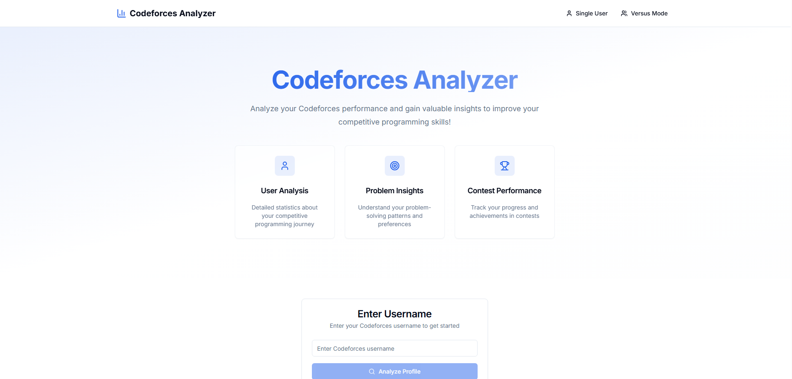
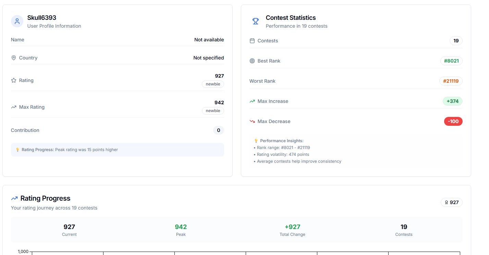
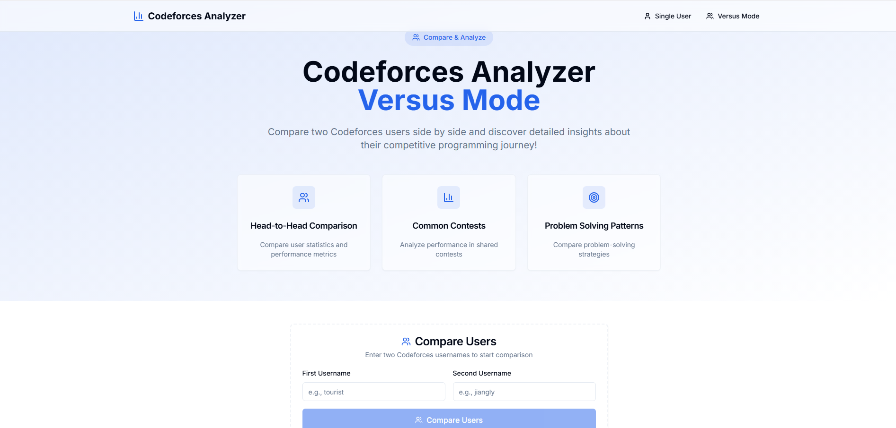
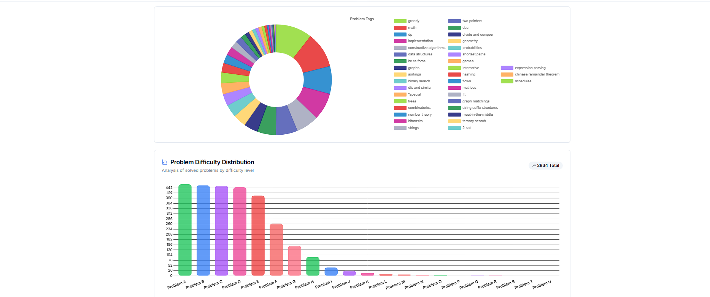

# 📊 Codeforces Analyzer

## 🚀 Elevate Your Competitive Programming Game!

Codeforces Analyzer is a powerful web application that provides in-depth insights and analysis for Codeforces users. Whether you're looking to improve your own performance or compare yourself with friends, our analyzer has got you covered!

[](https://github.com/Skull-crusher44/Codeforces-Analyzer_1/blob/main/LICENSE)
[](https://github.com/Skull-crusher44/Codeforces-Analyzer_1/stargazers)
[](https://github.com/Skull-crusher44/Codeforces-Analyzer_1/issues)

---

## ✨ Features

- 🧑‍💻 **Single User Analysis**: Get comprehensive statistics and visualizations for any Codeforces user.
- 🥊 **Versus Mode**: Compare two Codeforces users side by side and see who comes out on top!
- 📈 **Performance Metrics**: View detailed performance metrics including rating changes, problem-solving patterns, and contest history.
- 📊 **Interactive Graphs**: Visualize user data with stunning, interactive graphs powered by Chart.js.

---

## 🖼️ Screenshots

Feast your eyes on these beautiful screenshots of the Codeforces Analyzer in action!

| Home Page | Single User Analysis |
|:---------:|:--------------------:|
|  |  |

| Versus Mode | Rating Graph |
|:-----------:|:------------:|
|  |  |

---

## 🚀 Getting Started

Launch your own instance of Codeforces Analyzer in just a few simple steps:

1. **Clone the repository:**
   ```bash
   git clone https://github.com/Skull-crusher44/Codeforces-Analyzer_1.git
   cd Codeforces-Analyzer_1
   ```

2. **Install dependencies:**
   ```bash
   npm install
   ```

3. **Start the development server:**
   ```bash
   npm run dev
   ```

4. **Open your browser** and navigate to `http://localhost:3000/Codeforces-Analyzer`

---

## 🛠️ Built With

- ⚛️ [React](https://reactjs.org/) - A JavaScript library for building user interfaces
- ⚡ [Vite](https://vitejs.dev/) - Next Generation Frontend Tooling
- 🎨 [Shadcn UI](https://ui.shadcn.com/) - Beautifully designed components built with Radix UI and Tailwind CSS
- 💨 [Tailwind CSS](https://tailwindcss.com/) - A utility-first CSS framework
- 📊 [Chart.js](https://www.chartjs.org/) - Simple yet flexible JavaScript charting for designers & developers

---

## 📜 License

This project is licensed under the MIT License - see the [LICENSE](LICENSE) file for details.

---

## 🙏 Acknowledgments

- Thanks to [Codeforces](https://codeforces.com/) for providing the API that makes this analyzer possible.
- Special thanks to all contributors and users of the Codeforces Analyzer.
- Shoutout to the amazing competitive programming community!

---

<p align="center">
  Made with ❤️ by competitive programmers, for competitive programmers.
</p>
